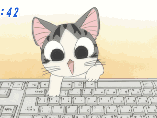

L'application Good Chat
=======================

Good Chat est une application très simple de chat en ligne. Elle permet à ses
utilisateurs de communiquer entre eux instantannément via des messages texte.

   On ne parle pas de ce chat là

Maquette
--------

Une maquette de l'application est disponible en ligne.

    http://ky9up3.axshare.com

Technologie
-----------

Pour servir l'exercice, l'application est conçue de la façon la plus simple
possible.

    - On considère qu'on utilisera forcément un navigateur digne de ce nom
      (c'est à dire pas Internet Explorer)
    - Le code HTML est écrit directement
    - Javascript
        - On utilise ES5
        - Pas de framework (pas de jQuery)
    - Style
        - Basé sur Bootstrap
        - Écrit en LESS et compilé grâce à WebStorm
    - On utilise `Firebase <https://www.firebase.com/>`_ pour faire communiquer
      les clients
    - Les dépendances sont gérées par Bower

Architecture
------------

Le TP est livré des fichiers qui n'ont pas besoin d'être modifiés

    - ``index.html`` contient le code HTML de la page ainsi qu'une balise
      ``<script type="application/template" id="tpl-message-row">`` qui contient
      le template HTML d'un message.
    - ``style.less`` (et la version compilée ``style.css``) contient quelques
      ajouts à Bootstrap.
    - ``goodchat.js`` est une abstraction au dessus de `Firebase` qui permet
      d'envoyer/recevoir des messages.
    - ``randname.js`` est une petite bibliothèque JS qui génère des noms
      aléatoires, pour le pseudo.

De ce fait, l'ensemble du code que vous devrez écrire sera rangé dans le fichier
``app.js`` qui est prévu à cet effet.
