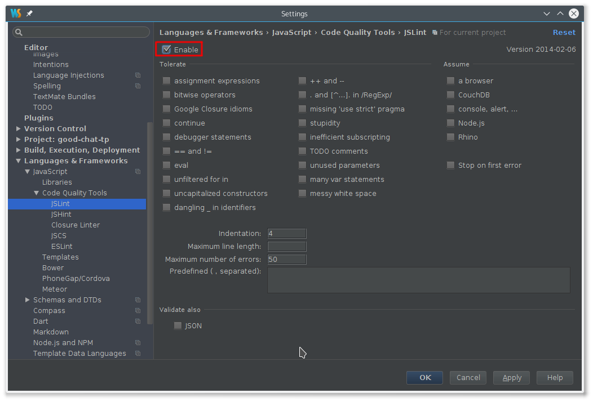

Démarer le TP
=============

Cette section rentre dans les détails de comment mettre en place l'environnement
de travail pour pouvoir travailler.

Vous mettrez en place l'environnement de travail, puis changerez de poste.
Faites donc attention à configurer l'ensemble correctement car c'est quelqu'un
d'autre qui utilisera cet environnement.

Prérequis
---------

Vous aurez besoin d'outils pour effectuer ce TP.

IDE
~~~

Un IDE est un outil essentiel pour le développeur. Il faut donc en choisir un
avec lequel on est à l'aise, et qui permette de collaborer efficacement avec
ses collègues. En l'occurence, WebStorm a été choisi, car même s'il est payant,
il a de nombreux arguments fonctionnels, et particulièrement une intégration
efficace à JSLint.

Vous devez configurer WebStorm de manière cohérente avec le reste de l'équipe.
Pour cela, vous devez vérifier que la configuration correspond aux screenshots
suivants.

.. figure:: img/settings1.png

.. figure:: img/settings3.png

.. figure:: img/settings4.png

Bower
~~~~~

Bower est un outil de gestion des dépendances client. Il permet de télécharger
et mettre automatiquement à jour les dépendances telles que Bootstrap ou
Firebase.

Pour l'installer, taper ``npm install -g bower`` dans un terminal.

HTTP Server
~~~~~~~~~~~

Pour servir les fichiers statiques, nous allons utiliser un serveur HTTP simple.
Il peut également être installé grâce à npm : ``npm install -g http-server``.

Installer les sources
---------------------

Vous aurez besoin des sources de base de ce TP. Pour cela, rendez-vous sur
`le dépôt GitHub <https://github.com/Xowap/good-chat-tp>`_. De là vous trouverez
l'adresse du dépôt Git à cloner pour pouvoir commencer le TP.

Démarer le serveur HTTP
-----------------------

Dans un terminal, rendez-vous dans le dossier où vous avez téléchargé les
sources, et lancez le serveur HTTP : ``http-server src``.

Vous pouvez vous rendre à l'adresse http://localhost:8080/ pour admirer
l'application vide que vous venez de démarer. Vous êtes maintenant prêts à
commencer le travail.
