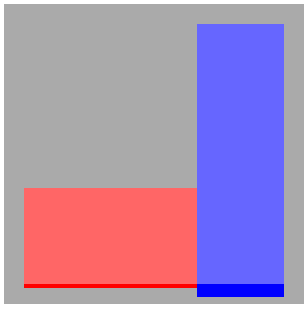

.. vim: fileencoding=utf-8 tw=80 expandtab ts=4 sw=4 :

Coding Style (and related)
==========================

Getting the style right is easy: a simple glimpse at the code will tell you if
it *looks* nice, and anyway most of IDEs are able to fix most of it by
themselves.

This is why there is absolutely no excuse to get the style wrong. Having a code
uniformly-looking helps reading the code afterwards, by a peer or by yourself,
and also helps seeing the structure of it. This *does* reduce the number of bugs
in the code you write and in the changes others will make as well.

Basically, once the good habits taken, they are totally painless to apply. We
wouldn't want to reject free improvement, right?

All-languages recommendations
-----------------------------

Those recommendations apply for all languages or kinds of text file you might
have to create.

White spaces
~~~~~~~~~~~~

There is two kinds of whitespaces in a source code:

indentation
    Whatever indentation you choose, keep it consistent in all the project.

trailing whitespaces
    Often, some whitespaces will be found after the line itself. This is *bad*.
    For each trailing space, a kitten dies.

In order to prevent any of those two to get wrong, there is two things to do:

- Enable the display of whitespaces in your IDE
- Enable the option that removes trailing whitespaces on save

.. _file-format:

File "format"
~~~~~~~~~~~~~

Plain-text/source code files must respect a few conventions

- All files are encoded in UTF-8.
- If possible, start the file with a Vim modeline, even if you don't use Vim,
  this is helpful to guess the indentation and line length settings.
- Use Unix (\n) line endings.
- The last line **must** include a line ending.
- No caps nor non-ASCII characters in file names, as those lead to problems due
  to inconsistencies accross operating systems.

.. note:: Why the fuck shoud the last line include a line ending you ask? Well,
          all lines are terminated with a line ending, why would the last one
          not be? Furthermore, if in a further revision of the code a line is
          added after the ex-last line, well that ex-last line will be
          considered by Git as modified because a line ending was added to it,
          which is not a good thing since that line was not actually modified.

Lines length
~~~~~~~~~~~~

Why should we bother about lines length since text editors of this century all
know how to wrap text?

The answer is quite simple and lies in the fact that even if editors can wrap
lines, I am sorry to tell you that your brain cannot hold too much information
at once. By convention, a line width is fixed, and should your line get longer
than this, it probably means that it has too much information and that it should
be chopped down for clarity.

Take the following example:

.. code-block:: python

    if some_shitty(thing(unreadable)) == some(other_stuff) and a < b and pouet \
       & BLAH and (something or (something_else and shit)):
       pass

Now consider this:

.. code-block:: python

    if some_shitty(thing(unreadable)) == some(other_stuff) \
            and a < b \
            and pouet & BLAH \
            and (something or (something_else and shit)):
       pass

The most readable snippet appears clearly.

Spelling, grammar and meaning
~~~~~~~~~~~~~~~~~~~~~~~~~~~~~

The official language for everything related to the code is English. The reason
behind this is that everybody speaks english, so if the team ever had to get
international this wouldn't be a hurdle. And anyways, code in any other language
feels awkward.

Meaning
.......

However, not everybody is fluent, and there is a lot of false friends around.
This is why when you name something, you have to be 100% positive that the
meaning is right. Especially in data models, where any change can be painful.

For this reason, in case of any doubt just use a dictionnary. And check
carefully the meaning of any database field before commiting it.

Grammar
.......

Please use a correct order of words in variables. It is basically
`"adjective"_"subject"_"complement"`. Like in `max_brace_area`. Not like
`area_max_brace`.

Spelling
........

No spelling mistakes are allowed in variable names. Beyond the fact that it
makes them look *nicer*, since most of the languages we use are dynamic, it
helps avoiding typos.

By example, if you type `my_stuff.attrbute` and that your IDE indicates a
spelling mistake, then you will notice that indeed you did want to write
`my_stuff.attribute`.

Again, this is a simple way to make less bugs.

Not all words will be in the dictionnary, but if you are absolutely sure that
the word exists, then feel free to add it to your dictionnary so it won't bother
you anymore.

Common pitfalls
...............

Let us go through some common issues met in variable names:

- `nb_objects` makes a few mistakes

  - Avoid using abbreviations, as they could be misunderstood

  - Maybe it's just me, but `number` feels awkward in this case, `count` sounds
    better

  - The order of words is wrong, the correct way would be `objects_count`

Conventions
~~~~~~~~~~~

Most languages have established conventions on formatting the source code, like
the PEP8, jslint, PSR-2, etc.

One might like or not the style of those conventions, however since they are
widely used, there is no reason not to follow them. Other developpers will know
them and will be more confortable reading the code.

Javascript
----------

Javascript leaves so much freedom to the developper that it becomes really easy
to make low quality and buggy code.

Of course, we want quality code, but even more, we want code that comes without
surprises and that any developper used to the style can easily read. Those
guidelines are thus very important if we want the Javascript development to go
smoothly.

Linting
~~~~~~~

As stated before, Javascript leaves too much freedom. In fact, some things that
can be done are harmful and error-prone. This is why Douglas Crockford created a
tool named `jslint <http://www.jslint.com/>`_. It ensures that your code keeps a
consistent formatting, and that you do not use dangerous features. He explains
most of his reasons in `a talk <http://www.youtube.com/watch?v=taaEzHI9xyY>`_
that anyone is strongly advised to watch, as well as in
`this page <http://javascript.crockford.com/code.html>`_.

Here is how we configure jslint in ActivKonnect:

.. highlight:: javascript
.. literalinclude:: code/style/jslint.js

indent: 4
    As expected, the indentation is of 4 spaces. This is the default, but let's
    state it explicitly just to make it very clear.

maxlen: 100
    The PEP8 explains it well, your brain can't handle an infinitely long
    strong. The industry standard would be around 80 columns, however as we have
    control over our own screens, we think it is best to use a 100 columns
    conventions.

Variable naming
~~~~~~~~~~~~~~~

The rules are pretty simple:

Constants
    All constants (aka content that should never vary, even though constants do
    not actually exist in JS) should be named in all-uppercase, and words must
    be separated by underscores. Ex: `THIS_IS_A_CONSTANT`

Objects
    Any constructor (aka something you have to call with `new`) must be named in
    camel case and **begin with an upper case**. Ex: `MyObjectName`

Variables and the rest
    Everything else comes in camel case and **must not** begin with an upper
    case. Ex: `myVariableName`

File template
~~~~~~~~~~~~~

All Javascript files must be structured this way

.. highlight:: javascript
.. literalinclude:: code/style/file_template.js

- There is a vim modeline, as explained in :ref:`file-format`.
- The JSLint options, that should never vary.
- List of global variables. This helps keeping track of dependencies. Usual
  suspects are `angular`, `_` and `jQuery`.
- The copyright statement, quite obviously.
- All the code is included in a `IIFE <http://en.wikipedia.org/wiki/Immediately-invoked_function_expression>`__
  in order to:

    - Minify the name of the global variables by passing them as arguments
    - Enable the `strict mode <https://developer.mozilla.org/en-US/docs/Web/JavaScript/Reference/Functions_and_function_scope/Strict_mode>`_

.. _object-template:

Object template
~~~~~~~~~~~~~~~

There is many ways to create objects in Javascript, but we have to stay
consistent in the way we do it. The stucture presented below results of many
trials and errors, and should work well in all situations.

Without inheritance
...................

.. highlight:: javascript
.. literalinclude:: code/style/object_template.js

Some explanations on the motivations behind this template:

- Checkout out `what Crockford <http://javascript.crockford.com/private.html>`_
  has to say on the matter.
- The `self = this` allows you to safely access the object from its methods and
  avoid the `tricky behaviour <http://www.quirksmode.org/js/this.html>`_ of
  `this`.
- Private members are declared as local variables of the constructor's closure.
  They can never be accessed from the outside, so be careful about what you put
  there.
- Public members are defined as members of `self`.
- All methods (public and private) are declared in a `var` statement. Why
  declare them here and not use regular named `functions`? Because according to
  JSLint, you can't reference a symbol that hasn't been defined yet (let's skip
  the reasons of that), so if methods were not defined this way, then you
  wouldn't be able to call `method2()` from `method1()`, by example.
- Public methods methods are declared with statements like
  `self.method1 = method1`.

    - Doing so makes it possible to switch a method from private to public without
      any refactoring.
    - It helps minification a lot. If you call `method3()` directly, the minifier
      can rename it as it pleases him. However, if you call `self.method3()`, then
      the minifier will only be able to rename `self` and will leave `method3`
      untouched.

- The code that would go in the constuctor if you used a traditionnal OO
  language goes into an `IIFE <http://benalman.com/news/2010/11/immediately-invoked-function-expression/>`__.

    - It helps readability, because you know exactly where the code begins and
      ends, and it is always located in the same place.
    - If you want a local variable that does not have to be a private member, you
      can declare it at the beginning of the IIEF. This way, it will not stay in
      the object forever.

With inheritance
................

Some tests were conducted to see what inheritance patterns could be used,
however currently there is not enough use of it to actually decide anything.

Anyways, it's best to create small orthogonal objects than a big comprehensive
object with a huge genealogy tree.

Python
------

There is not much to be said here about Python, since the Python community is
quite organized yet, and almost everything already has best practices
determined.

PEP8
~~~~

The `PEP8 <http://legacy.python.org/dev/peps/pep-0008/>`_ provides an excellent
guideline regarding the coding style.

Use the pythonic way
~~~~~~~~~~~~~~~~~~~~

The Python language is very flexible, and you can very easily replicate what you
would write in other languages. However, this is a trap, as many things have a
*pythonic* way of doing them, and it's often different from other languages, and
especially from Java.

To name a few:

- Not everything has to be in classes. Stand-alone functions are fine too.
- There is many literals for maps, lists, tuples, sets, etc. Use them.
- Use the `property` built-in instead of creating getters and setters the way
  you would do it in Java.

LESS/CSS
---------------

No official documentation exists or stands out for CSS, and even fewer regarding
LESS. However, the following inspirations were used here:

`@mdo's Code Guide <http://codeguide.co/>`_
    Written by @mdo, one of the guys behind Bootstrap, is basically interesting,
    except for a few unexplained weird things like the choice to omit the 0 in
    small floats (`0.5` vs `.5`), and the advice to make one-liner declarations.
`Github's Guideliens <https://github.com/styleguide/css>`_
    A few interesting ideas, their style is documented with
    `KSS <https://github.com/kneath/kss>`_, which is something we might end up
    doing.
`CSS Guidelines <http://cssguidelin.es/>`_
    Some high-level rules for writing clean CSS, which are basically specialized
    in this document.

Whitespaces
~~~~~~~~~~~

- Use soft-tabs with a two space indent. Spaces guarantee that code renders the
  same way accross editors, and two spaces is the most used convention in CSS.
- Put spaces after `:` in property declarations, but not before.
- Put spaces before `{` in rules declarations.
- Put line breaks between rulesets.
- When grouping selectors, keep individual selectors to a single line.
- Place `}` at the end of declaration blocks on a new line.
- No more than a single declaration per line, for readability and error
  reporting.
- Always put a space after a coma

Formatting
~~~~~~~~~~

- For colors, use whenever possible, by order of priority
    - The pre-defined variable for that color
    - Color names, like `white`
    - Short-hand notations, like `#abc`
    - Hex colors, like `#fabb00`
    - `rgba()`, like `rgba(1, 1, 1, 0.5)`
- Don't put units with zero. `0` is right, `0px` is wrong.

A few exemple of what is right or wrong:

.. highlight:: css
.. literalinclude:: code/style/good_bad_css.css

Declaration Order
~~~~~~~~~~~~~~~~~

Place property declarations in that order:

#. Positioning
#. Box model
#. Animations
#. Typographic
#. Visual
#. Other
#. LESS Nested Declarations

Here is an exemple:

.. highlight:: css
.. literalinclude:: code/style/declaration_order.css

Vendor prefixes
~~~~~~~~~~~~~~~

Many modern CSS features depend on vendor prefixes. In order to eliminate the
difference between browsers, we use the prefixed version of
`LESS Hat <http://lesshat.madebysource.com/>`_, which automatically generates
styles for every browser, including for complex properties like gradients.

It must always be used for properties that it handles, and vendor prefixes must
not be written manually.

Selectors
~~~~~~~~~

A lot has been written about selectors, and it is mostly summarized in the
`CSS Guidelines <http://cssguidelin.es/#css-selectors>`__. What is said in there
has to be kept in mind, but with the experience of GMP, a few rules seem to be
especially important.

Try to scope CSS per component
    Each component (think "directive" or simply a noticeable UI component)
    should get its own `.gmp-X` class. It helps namespacing things under it.

    .. literalinclude:: code/style/css_scope.less
       :language: less

    .. literalinclude:: code/style/css_scope.html
       :language: html

Avoid using selectors that go deep into the DOM
    If you use a selector like `.gmp-my-stuff button`, it will affect all the
    buttons inside your component, including those from third party directives
    you could decide to include later on.

    Better solutions would be `.gmp-my-stuff > button` if possible or using a
    class for the button `.gmp-my-stuff .stuff-button`.

Factorize styles
    In the previous example we select a button inside our component, however in
    the case of buttons there is much to bet on the fact that this particular
    button will look like all buttons on the site. For this reason, it could be
    considered as a component itself, and get its own namespace.

    .. literalinclude:: code/style/css_factorize.html
       :language: html

LESS And Magic Numbers
~~~~~~~~~~~~~~~~~~~~~~

One of the worst things that can happen to a CSS stylesheet, is to get it
filled with many interdependant values (dimensions, positions, colors, ...)
but without knowing where does the calculation comes from. In those cases,
changing even the smallest thing can lead to many unwanted side-effects.

In order to compensate that and to document the values, before starting to
style, all the useful numbers/colors should be put at the beginning of each
component.

.. note::

    Those variables will be scoped to the component, and will not be
    available outside of it, so you are free to choose a straightforward
    name for it.

As example, we can take the following piece of abstract act:

The idea is basically to have a box, with a given padding, with two other
boxes inside, that keep the padding rule but have a bottom border that
expands into the padding.

The following LESS code allows to produce just that, with a few configurable
variables at the top.

.. literalinclude:: code/style/magic_number.html
   :language: html

.. literalinclude:: code/style/magic_number.css
   :language: css
   :emphasize-lines: 6-18
